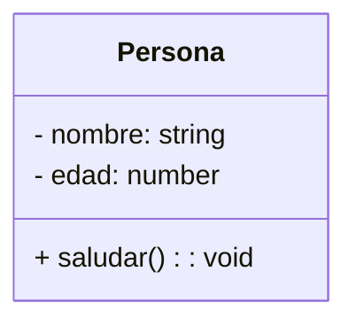
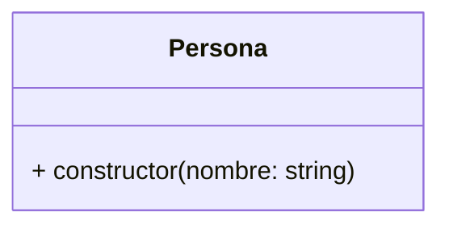
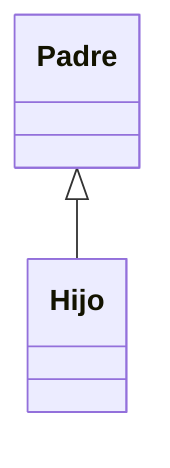
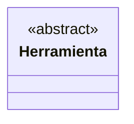
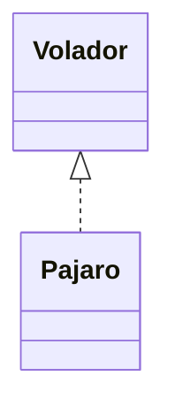
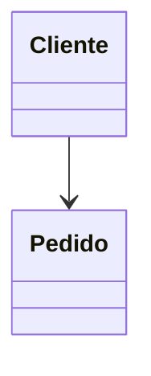
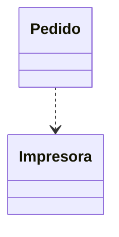
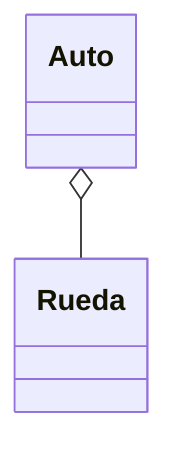

Mermaid permite crear diagramas escribiendo texto.

En Obsidian, GitHub y VS Code podés escribir:

```  m e r m a i d
classDiagram  

class Persona
```

y automáticamente se renderiza un diagrama.

---

## Estructura básica

``` m e r m a i d
classDiagram

class Persona {
	- nombre: string
	- edad: number
	+ saludar(): void
}
```

**Resultado**:


---

## Privacidad

| **Símbolo** | **Significado** |
| :---------: | :-------------: |
|      +      |     public      |
|      -      |     private     |
|      #      |    protected    |

---

## Constructor

**Ejemplo**:
``` m e r m a i d
classDiagram

class Persona {
   + constructor(nombre: string)
}
```

**Se representa como**:


---

## Herencia

**Sintaxis**
``` m e r m a i d
ClassDiagram

Padre <|-- Hijo
```

**Representación**


---

## Clase abstracta

**Sintaxis**
```m e r m a i d
classDiagram  

class Herramienta {  
<<abstract>>  
}
```

**Representación**


---

## Interfaces

**Sintaxis**
```m e r m a i d
classDiagram  

Volador <|.. Pajaro
```


**Representación**

---

## Relaciones

--- 

### Asociación
Una clase conoce o utiliza otra.

**Sintaxis**
```m e r m a i d
classDiagram  

Cliente --> Pedido
```

**Representación**


> Un Cliente tiene relación con un Pedido.

---

### Dependencia
Uso temporal.

**Sintaxis**
```m e r m a i d
classDiagram  

Pedido ..> Impresora
```

**Representación**


> Pedido utiliza una Impresora.

---

## Agregación
La parte puede existir sin el todo.

**Sintaxis**
```m e r m a i d
classDiagram  

Auto o-- Rueda
```

**Representación**


> Un Auto tiene Ruedas.
> Las Ruedas pueden existir independientemente.

---

## Composición
La parte pertenece completamente al todo.

**Sintaxis**
```m e r m a i d
classDiagram  

Casa *-- Habitacion
```

**Representación**

ra:

> Una Casa está compuesta por Habitaciones.
> 
> Si desaparece la Casa, desaparecen las Habitaciones.

---

## Multiplicidades

### Uno a muchos

Lectura:

> Un Cliente puede tener muchos Pedidos.

---

### Uno a uno

---

### Muchos a muchos

---

## Ejemplo completo

---

## Chuleta rápida

|Relación|Mermaid|
|---|---|
|Herencia|`<|
|Implementa interfaz|`<|
|Asociación|`-->`|
|Dependencia|`..>`|
|Agregación|`o--`|
|Composición|`*--`|

---

## Flujo recomendado para la facultad

```
Análisis   ↓UML (Mermaid)   ↓TypeScript   ↓Testing
```

Primero pensá las clases y relaciones.

Después escribí el código.

Eso suele hacer mucho más fácil detectar errores de diseño antes de programar. 🚀